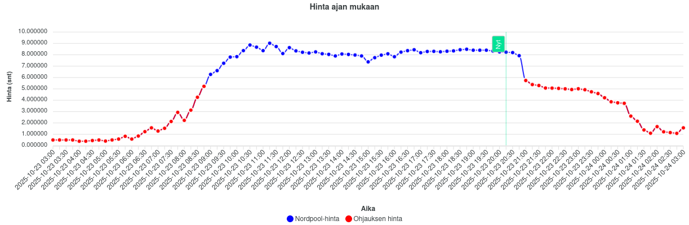
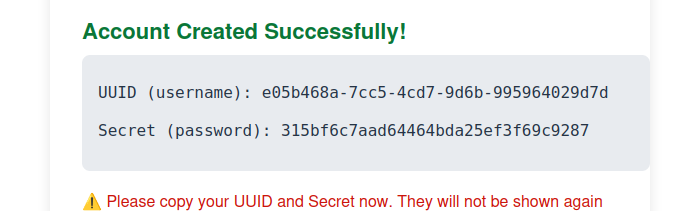
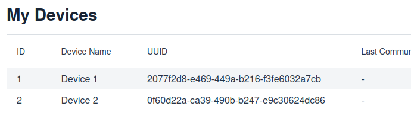

# Pörssiohjain



Pörssiohjain on Springin päälle rakennettu yksinkertainen online sovellus, joka hakee Nordpoolista pörssisähkön hinnat
ja päivittää ohjaukset. Laitteesi esim Shelly kutsuu control rajapintaa ja saa vastauksena kanavakohtaiset ohjauksien
tilat, eli käytännössä konfiguroidut kavananumerot ja tila päälle/pois päältä.

Käyttöliittymä on tehty Vaadinilla ja renderöityy palvelimen puolella. Käyttöliittymän tarkoitus on olla mahdollisimman
yksinkertainen kun tavoite on että siellä käydään harvoin.

⚠️ En takaa minkäänlaista uptimea esimerkin palvelimelle (tälle palvelulle). Jos sinulla on tarjota virtuaalikone,
kubernetes, docker tai vastaava muu ympäristö missä ajaa tätä sovellusta niin ota yhteyttä.

## Asennusohje

### Palvelun tili ja asetukset

#### Käyttäjätili

Aloita luomalla käyttäjätili ja kopioi tiedot talteen, sillä ne näkyvät vain tämän kerran.



#### Laitteiden lisäys

Kirjautumisen jälkeen mene lisäämään laitteet ja ota UUID talteen.
UUID laitetaan esim Shelly scriptissä `DEVICE_UUID` kohtaan.



#### Ohjausten tekeminen

Luo ohjaukset `My controls` näkymässä asettaen moodi, vero, max hinnat.

Ohjauksissa lisätään valikosta laitteet ja kanavat mitä haluat ohjata.

### Shelly skripti

* Konfiguroinnissa kanavat alkavat arvosta `0`

```javascript
const DEVICE_UUID = '28217a08-df0b-4d21-b2b8-66a321cc6658';
const API_URL = 'https://porssiohjain.nitramite.com/control/' + DEVICE_UUID;
const RELAY_DEFAULT_STATE = "OFF"; // ON or OFF
const DEVICE_RELAY_COUNT = 1; // How many relay outputs your shelly has in total?

function setRelay(id, state) {
    Shelly.call('Switch.Set', {id: id, on: state}, function (res, err) {
        if (err) {
            print('Failed to set relay', id, ':', JSON.stringify(err));
        } else {
            print('Relay', id, 'set to', state ? 'ON' : 'OFF');
        }
    });
}

function defaultStateBool() {
    return RELAY_DEFAULT_STATE === "ON";
}

function applyDefaultState() {
    print("Applying default relay state:", RELAY_DEFAULT_STATE);
    let fallback = defaultStateBool();
    for (let i = 0; i < DEVICE_RELAY_COUNT; i++) {
        setRelay(i, fallback);
    }
}

function getUnixTime(callback) {
    Shelly.call('Sys.GetStatus', {}, function (res, err) {
        if (!err && res && res.unixtime) {
            callback(Math.floor(res.unixtime));
        } else {
            print('Failed to get time:', JSON.stringify(err));
            callback(0);
        }
    });
}

function fetchControlData() {
    Shelly.call('HTTP.REQUEST', {
        method: 'GET',
        url: API_URL,
        headers: {'Content-Type': 'application/json'},
        timeout: 10
    }, function (res, err) {
        if (err || res.code !== 200) {
            print('API call failed:', JSON.stringify(err || res));
            applyDefaultState();
            return;
        }

        let data = {};
        try {
            data = JSON.parse(res.body);
        } catch (e) {
            print('Invalid JSON response:', res.body);
            applyDefaultState();
            return;
        }

        for (let key in data) {
            let state = !!data[key]; // convert 0/1 to boolean
            setRelay(parseInt(key), state);
        }
    });
}

function scheduleEveryFiveMinutes() {
    getUnixTime(function (now) {
        let nextFiveMinute = Math.floor(now / 300) * 300 + 300;
        let delay = (nextFiveMinute + 10 - now) * 1000;
        print('Next API call in', delay / 1000, 'seconds');

        Timer.set(delay, false, function () {
            fetchControlData();
            scheduleEveryFiveMinutes();
        });
    });
}

fetchControlData();
scheduleEveryFiveMinutes();
```

## Kehittämiseen liittyvää

Todo

### Ympäristömuuttujat

```env
export DB_HOST=localhost
export DB_PORT=5432
export DB_NAME=porssiohjain
export DB_USER=porssiohjain
export DB_PASSWORD=porssiohjain
``` 
