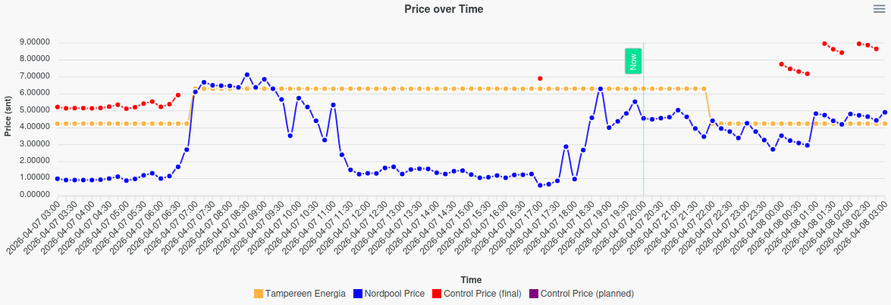
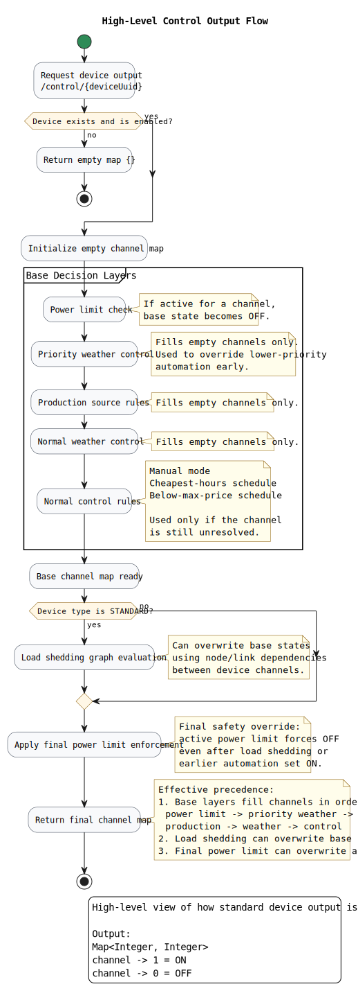
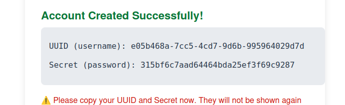
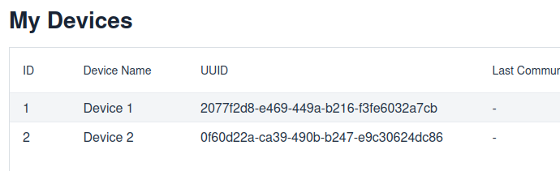

# Pörssiohjain 2000 ™



<b>Pörssiohjain</b> is an energy automation service for controlling household loads with electricity spot prices,
consumption limits, own production and weather data. It is built with Spring Boot and a simple server-rendered Vaadin
UI.

## Service Domains

Official Pörssiohjain services are available at:

* [https://app.porssiohjain.fi](https://app.porssiohjain.fi)
* [https://app.energiaohjain.fi](https://app.energiaohjain.fi)
* Marketing page: https://www.porssiohjain.fi
* Hybrid web project for webview also available at https://mobile.porssiohjain.fi

Only domains listed here should be treated as official service domains.

⚠️ Pörssiohjain may be used free of charge with limitations by private individuals for their own household use
by running a private self-hosted instance.

Commercial use, resale, managed hosting, customer installations, or offering the software or a hosted instance to third
parties is not allowed without a separate written commercial license. I am developing this as a paid company product
with broader functionality and different service tiers.

If Pörssiohjain has helped you financially, consider [donating coffee money](https://buymeacoffee.com/norkator).

## UML Diagrams

Editable PlantUML sources live in [doc/README-diagrams.md](./doc/README-diagrams.md).

### Standard Device Output Flow



Editable source: [doc/control-output-high-level.puml](./doc/control-output-high-level.puml)

## Features

* Nord Pool spot price fetching and scheduled price-based control.
    * Below-max-price, cheapest-hours and manual control modes.
    * Daily runtime targets and always-on-below-min-price support.
    * Energy and transfer contract support, including static and day/night transfer pricing.
* Standard device control.
    * Channel-based control output for devices such as Shelly relays.
    * HTTP control API and MQTT authentication support.
    * Per-device online status, credentials and UUID-based device integration.
* Heat pump control.
    * Toshiba and Mitsubishi AC account integrations.
    * Device discovery and saved heat-pump state control.
    * Toshiba state hex decoding/editing for power, mode and target temperature.
* Power limits.
    * Real-time consumption reporting endpoint for meters such as Shelly Pro 3EM.
    * Automatic load shedding when the configured power limit is exceeded.
    * Current kW, peak kW, interval history and consumption charting.
    * Optional power-limit exceeded email alerts.
* Own production automation.
    * SOFAR / SolarmanPV production polling.
    * Current production, peak production and production history charting.
    * Production-based device and heat-pump rules.
* Weather controls.
    * FMI weather forecast fetching for configured sites.
    * Temperature and humidity based device and heat-pump rules.
    * Weather control priority support for overriding lower-priority automation.
* Automation priority handling.
    * Standard devices: power limit, own production, then price control.
    * Heat pumps: weather control, own production, then price control.
* Dashboard and reporting.
    * Device status overview and system log.
    * Fingrid wind forecast and price prediction widgets.
    * Site energy usage, monthly cost charts and estimated control savings.
* Sites, contracts and account settings.
    * Site grouping with weather places and site types.
    * Electricity contract management.
    * Account tiers, resource limits, language selection and notification settings.
* Resource sharing and onboarding.
    * Share devices, controls, production sources and power limits with other account UUIDs.
    * Onboarding status and checklist API.
* Documentation and APIs.
    * Built-in documentation pages.
    * REST endpoints for account, device, control, power, dashboard, onboarding and Nord Pool data.

## Installation Guide

### Service Account and Settings

#### User Account

Start by creating a user account and copy the credentials immediately, because they are shown only once.



#### Adding Devices

After logging in, add your devices and copy the UUID.
For example, in the Shelly script, this UUID is used as the `DEVICE_UUID` value.



#### Creating Controls

Create controls in the `My controls` view by setting the mode, tax, and maximum prices.

In each control, add the devices and channels you want to control from the menu.

### Shelly Script for Controls

Note that channel numbering starts from `0` in the configuration.

```javascript
const DEVICE_UUID = '28217a08-df0b-4d21-b2b8-66a321cc6658';
const API_URL = 'https://porssiohjain.nitramite.com/control/' + DEVICE_UUID;
const RELAY_DEFAULT_STATE = "OFF"; // ON or OFF
const DEVICE_RELAY_COUNT = 1; // How many relay outputs your shelly has in total?

function setRelay(id, state) {
    Shelly.call('Switch.Set', {id: id, on: state}, function (res, err) {
        if (err) {
            print('Failed to set relay', id, ':', JSON.stringify(err));
        } else {
            print('Relay', id, 'set to', state ? 'ON' : 'OFF');
        }
    });
}

function defaultStateBool() {
    return RELAY_DEFAULT_STATE === "ON";
}

function applyDefaultState() {
    print("Applying default relay state:", RELAY_DEFAULT_STATE);
    let fallback = defaultStateBool();
    for (let i = 0; i < DEVICE_RELAY_COUNT; i++) {
        setRelay(i, fallback);
    }
}

function getUnixTime(callback) {
    Shelly.call('Sys.GetStatus', {}, function (res, err) {
        if (!err && res && res.unixtime) {
            callback(Math.floor(res.unixtime));
        } else {
            print('Failed to get time:', JSON.stringify(err));
            callback(0);
        }
    });
}

function fetchControlData() {
    Shelly.call('HTTP.REQUEST', {
        method: 'GET',
        url: API_URL,
        headers: {'Content-Type': 'application/json'},
        timeout: 10
    }, function (res, err) {
        if (err || res.code !== 200) {
            print('API call failed:', JSON.stringify(err || res));
            applyDefaultState();
            return;
        }

        let data = {};
        try {
            data = JSON.parse(res.body);
        } catch (e) {
            print('Invalid JSON response:', res.body);
            applyDefaultState();
            return;
        }

        if (!data || Object.keys(data).length === 0) {
            print('Empty JSON response');
            applyDefaultState();
            return;
        }

        for (let key in data) {
            let state = !!data[key]; // convert 0/1 to boolean
            setRelay(parseInt(key), state);
        }
    });
}

function scheduleEveryFiveMinutes() {
    getUnixTime(function (now) {
        let nextFiveMinute = Math.floor(now / 300) * 300 + 300;
        let delay = (nextFiveMinute + 10 - now) * 1000;
        print('Next API call in', delay / 1000, 'seconds');

        Timer.set(delay, false, function () {
            fetchControlData();
            scheduleEveryFiveMinutes();
        });
    });
}

fetchControlData();
scheduleEveryFiveMinutes();
```

### Shelly Script for Power Limits

Create a power limit in the service and copy the power limit UUID. Set it in the script below, which should be installed
on the sending device, such as a Shelly Pro 3EM.

```javascript
const DEVICE_UUID = '28217a08-df0b-4d21-b2b8-66a321cc6658';
const API_URL = 'https://porssiohjain.nitramite.com/power/' + DEVICE_UUID;
const POLL_INTERVAL_MS = 1 * 60 * 1000; // every minute

function sendCurrentKw() {
    let emStatus = Shelly.getComponentStatus("em", 0);

    if (!emStatus) {
        print("EM component unavailable");
        return;
    }

    let totalW = 0;
    if (typeof emStatus.total_act_power === "number") {
        totalW = emStatus.total_act_power;
    } else {
        totalW =
            (typeof emStatus.a_act_power === "number" ? emStatus.a_act_power : 0) +
            (typeof emStatus.b_act_power === "number" ? emStatus.b_act_power : 0) +
            (typeof emStatus.c_act_power === "number" ? emStatus.c_act_power : 0);
    }


    let emData = Shelly.getComponentStatus("emdata", 0);

    let totalWh = 0;
    if (emData) {
        if (typeof emData.total_act === "number") {
            totalWh = emData.total_act;
        } else {
            totalWh =
                (typeof emData.a_total_act_energy === "number" ? emData.a_total_act_energy : 0) +
                (typeof emData.b_total_act_energy === "number" ? emData.b_total_act_energy : 0) +
                (typeof emData.c_total_act_energy === "number" ? emData.c_total_act_energy : 0);
        }
    }

    let currentKw = totalW / 1000;
    let totalKwh = totalWh / 1000;
    let measuredAt = Date.now();

    let body = JSON.stringify({
        currentKw: currentKw,
        totalKwh: totalKwh,
        measuredAt: measuredAt
    });

    Shelly.call("HTTP.REQUEST", {
        method: "POST",
        url: API_URL,
        headers: {"Content-Type": "application/json"},
        body: body,
        timeout: 10
    }, function (res, err) {
        if (err || res.code !== 200) {
            print("API POST failed:", JSON.stringify(err || res));
            return;
        }
        print("Successfully sent currentKw:", currentKw, "kW");
    });
}

sendCurrentKw();
Timer.set(POLL_INTERVAL_MS, true, sendCurrentKw);
```

### Environment Variables

```env
export DB_HOST=localhost
export DB_PORT=5432
export DB_NAME=porssiohjain
export DB_USER=porssiohjain
export DB_PASSWORD=porssiohjain
export FINGRID_API_ENABLED=true
export FINGRID_API_KEY=xxxxxx
export RESEND_API_KEY=re_xxxxxx
export ALERTS_MAIL_ADDRESS=xxxxxx
export ADMIN_MAIL_ADDRESS=xxxxxx@xxxxxx.xx
export APP_CRYPTO_KEY=(run node app_crypto_key.js)
export MQTT_BROKER_ADDRESS=localhost
export MQTT_BROKER_PASSWORD=xxxxxx
export MQTT_CLIENT_ID=xxxxxx
``` 

## License

This project is licensed under the Pörssiohjain Personal Use License v1.0.

Private individuals may self-host it for their own household use. Commercial use, resale, managed hosting, customer
installations, or offering it as a service to third parties requires a separate written commercial license.

See the LICENSE file for details.
